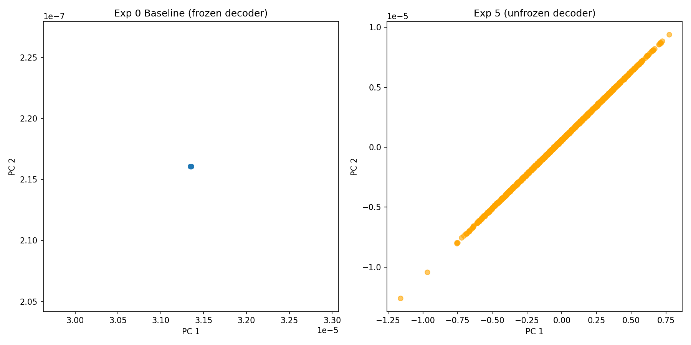

# dnnls_final_project_2

This is my DNNL project. The task is: given 4 frames of a comic-style story (each with an image and
a text description), predict what the 5th frame looks like, both the image and the text. Module is
Deep Neural Networks and Learning Systems (55-710365), Sheffield Hallam.

## What the model actually is

A visual encoder (either a small CNN I built or a frozen pretrained ResNet-18, depending on the
experiment) turns each frame into a vector. A text encoder (pretrained LSTM autoencoder, kept frozen
in most experiments) does the same for the description. These get fused - either just concatenated
together, or run through a cross-modal attention block I wrote so the image and text vectors can
attend to each other before fusing. The fused sequence goes through a GRU to get one vector
representing "what should come next", which then gets decoded back into an image and some text.

Dataset is [daniel3303/StoryReasoning](https://huggingface.co/datasets/daniel3303/StoryReasoning) on
HuggingFace. Trained everything in Colab since I don't have a GPU locally.

## The two components I picked to improve

In my pre-registration I picked the **visual encoder** and the **sequence predictor** as the two
components to work on - they were the two parts I understood well enough to make deliberate changes
to instead of just guessing.

**Visual encoder - transfer learning with ResNet-18 (Exp 2, Exp 3).** The baseline uses a small CNN
trained from scratch. I swapped it for a pretrained, frozen ResNet-18 to see if ImageNet features
transfer to these comic-style frames:

```python
class ResNetVisualEncoder(nn.Module):
    """
    Pretrained ResNet-18 visual encoder with frozen backbone.
    Applies ImageNet normalisation internally so the dataset only needs ToTensor().
    Projects 512-dim ResNet features down to latent_dim.
    """

    def __init__(self, latent_dim=16, freeze_backbone=True):
        super().__init__()
        resnet = models.resnet18(weights=models.ResNet18_Weights.IMAGENET1K_V1)
        self.backbone = nn.Sequential(*list(resnet.children())[:-1])
        if freeze_backbone:
            for p in self.backbone.parameters():
                p.requires_grad = False
        self.projection = nn.Sequential(nn.Linear(512, latent_dim), nn.ReLU())
        self.register_buffer('mean', torch.tensor([0.485, 0.456, 0.406]).view(1, 3, 1, 1))
        self.register_buffer('std',  torch.tensor([0.229, 0.224, 0.225]).view(1, 3, 1, 1))

    def forward(self, x):
        x = (x - self.mean) / self.std
        return self.projection(self.backbone(x).flatten(1))
```

Full class: `ResNetVisualEncoder` in `src/model.py`. Result: this made things slightly worse, not
better (4.406 vs baseline's 4.361, see Table 1)

**Sequence predictor - cross-modal attention (Exp 1 onward).** The baseline just concatenates the
image vector and text vector before feeding them to the GRU. I replaced that with a bidirectional
attention block so each modality can attend to the other first:

```python
class CrossModalAttention(nn.Module):
    """
    Bidirectional cross-modal attention between image and text embeddings.
    Image attends to text and text attends to image — each modality is
    enriched with context from the other before fusion.
    """

    def __init__(self, dim):
        super().__init__()
        self.scale = dim ** 0.5
        self.q_img = nn.Linear(dim, dim)
        self.k_txt = nn.Linear(dim, dim)
        self.v_txt = nn.Linear(dim, dim)
        self.q_txt = nn.Linear(dim, dim)
        self.k_img = nn.Linear(dim, dim)
        self.v_img = nn.Linear(dim, dim)
        self.norm_img = nn.LayerNorm(dim)
        self.norm_txt = nn.LayerNorm(dim)

    def forward(self, z_img, z_txt):
        i = z_img.unsqueeze(1)
        t = z_txt.unsqueeze(1)
        attn_i2t = torch.softmax(
            (self.q_img(i) @ self.k_txt(t).transpose(-2, -1)) / self.scale, dim=-1
        )
        z_img_out = self.norm_img(z_img + (attn_i2t @ self.v_txt(t)).squeeze(1))
        attn_t2i = torch.softmax(
            (self.q_txt(t) @ self.k_img(i).transpose(-2, -1)) / self.scale, dim=-1
        )
        z_txt_out = self.norm_txt(z_txt + (attn_t2i @ self.v_img(i)).squeeze(1))
        return z_img_out, z_txt_out, attn_i2t.squeeze(1), attn_t2i.squeeze(1)
```

Full class: `CrossModalAttention` in `src/model.py`, used by `CrossModalSequencePredictor` and its
variants (Exp 1, 3, 4, 5, 8, 9, 10). Result: 4.360 vs baseline's 4.361 on its own (Exp 1) -
essentially no change by itself. It only mattered once combined with unfreezing the text decoder in
Exp 5 (see Table 1 and the per-experiment breakdown below).

## Results

Honestly the loss numbers across most experiments are annoyingly close together, which made it hard
to tell what was actually helping. Here's what I got:


**Figure 1:** Training loss curves for all 11 experiments, plotted together. Most variants (concat
vs. cross-modal attention, CNN vs. ResNet-18, BiGRU, deeper GRU) sit in a flat cluster around
4.3-4.4 and barely move. Exp 8/9 (perceptual loss) start higher on a different loss scale but trend
down. The two curves that actually break away from the cluster and keep dropping - Exp 5 and Exp
10 - are the only ones with the text decoder unfrozen and 60 full epochs, ending at 3.61. That
combination is the one change that mattered; everything else is noise around the same plateau.

**Table 1:** Final training loss per experiment (same data as Figure 1, as numbers).

| # | What changed | Epochs | Final loss |
|---|---|---|---|
| 0 | Baseline (CNN + concat + GRU) | 25 | 4.3612 |
| 1 | Cross-modal attention instead of concat | 25 | 4.3605 |
| 2 | Swapped in frozen ResNet-18 | 35 | 4.4059 |
| 3 | ResNet-18 + cross-modal attention together | 25 | 4.3705 |
| 4 | Bigger latent dim (64 instead of 16) | 25 | 4.3610 |
| 5 | Unfroze the text decoder + wider GRU (64) | 60 | **3.6093** |
| 6 | Bidirectional GRU | 25 | 4.3620 |
| 7 | 2-layer GRU | 25 | 4.3521 |
| 8 | Added VGG perceptual loss | 25 | 4.3135 |
| 9 | latent64 + perceptual loss + unfrozen decoder combined | 30 | 4.3089 |
| 10 | Sharper decoder (pixel shuffle instead of transposed conv) | 60 | **3.6077** |

Exp 5 is clearly the best number, but I should be upfront that it also just got way more epochs (60
vs 25-35 for everything else), so it's not really a fair one-variable-at-a-time comparison, more like
"the thing I happened to let train the longest also unfroze more of the model." Worth saying that
plainly rather than pretending it's a clean result.

Also, exp 8 and 9's numbers aren't really comparable to the others since they have an extra VGG
perceptual loss term added on top of the normal loss, so the number itself is measuring something
slightly different.

_loss.png)
**Figure 2:** Training loss for Exp 5 on its own (unfrozen text decoder + GRU-64), 60 epochs. Loss
drops steadily across the full run with no plateau or divergence, ending at 3.61 - the lowest of any
experiment.

## Going through each experiment

**Exp 0 - Baseline.** Change: nothing yet, this is the starting point - CNN encoder, simple concat
fusion of image and text vectors, GRU-16, text decoder frozen. Result: 4.361 after 25 epochs.
Analysis: this is the number everything else gets compared against. Nothing special to say about it
except that its own visual latent space turned out to be almost completely collapsed (Figure 5) -
so whatever the other experiments changed, none of it was fixing that.

**Exp 1 - Cross-modal attention instead of concat.** Change: replaced the simple concatenation of
image and text vectors with a bidirectional attention block I wrote, so each modality can attend to
the other before fusing. Result: 4.360, 25 epochs - functionally the same as baseline. Analysis:
this was supposed to be the interesting one and it did basically nothing. Either the attention
block isn't wired to matter much for this loss, or the bottleneck is somewhere else entirely (which,
given Figure 5, it probably is - no amount of fusion logic helps if the encoder feeding it is
already collapsed).

**Exp 2 - Frozen ResNet-18 instead of my CNN.** Change: swapped the from-scratch CNN visual encoder
for a pretrained, frozen ResNet-18. Result: 4.406, 35 epochs - slightly worse than baseline, not
better. Analysis: pretrained ImageNet features didn't transfer well to these small, comic-style
frames, or 512-dim frozen features projected down to 16 lost more than they gave. Either way, more
"sophisticated" encoder, worse number.

**Exp 5 - Unfroze the text decoder + GRU-64.** Change: two things at once - let the text decoder
actually adapt during training instead of staying frozen, and widened the GRU from 16 to 64. Result:
3.61, the best of all 11, and the only training curve that doesn't plateau (Figure 2). Analysis:
this is also the only experiment I ran PCA on that shows any real spread in the visual latent space
(Figure 5) - though I don't have a solid explanation for why, since Exp 10 has the same GRU width
and also unfroze the decoder, yet collapsed anyway. What I can say for sure is this needed 60 epochs
to get here, more than double most other runs, so part of "best" is just "trained longest."

**Exp 8 - VGG perceptual loss.** Change: replaced plain L1 pixel loss with a VGG-feature-based
perceptual loss, on top of Exp 5's config (GRU-64, unfrozen decoder). Result: 4.31 over 25 epochs -
but this number isn't on the same scale as the others, since perceptual loss is a different
quantity than L1, so it can't be read as "worse than Exp 5's 3.61." Analysis: I can't honestly say
whether this helped or not without re-measuring on a common metric, which I didn't get to.

**Exp 10 - Sharper decoder (pixel shuffle).** Change: swapped the transposed-convolution decoder for
a pixel-shuffle based one, meant to remove checkerboard artifacts, built on top of Exp 5's config.
Result: 3.61, matching Exp 5 almost exactly. Analysis: this is the one with the actual bug - the
decoder's forward pass called the same internal function twice for content and context, so the
"sharper" decoder produced the same flat gray blob as everything else (see the bug writeup below).
The loss number looked fine; the image did not.

Full config and training log for every experiment (including the ones not covered here) are in
`results/expN/config.md` and `results/expN/training_log.txt`.

## What the predictions actually look like

The loss table above hides something the numbers alone don't show: the predicted images across
every single experiment come out as a flat gray/beige blob, no visible structure. Here's exp 9 and
exp 10, predicted frame next to ground truth:


**Figure 3:** Predicted frame vs. ground truth, Exp 9 (top) and Exp 10 (bottom) - the two lowest-loss
runs after Exp 5. Both collapse to a near-uniform gray/beige field with no structure, despite falling
loss values throughout training. Text prediction and the loss curve were both improving normally, so
this is specifically an image-decoder failure - see the bug writeup below for the actual cause.

## Explainability (Grad-CAM)

Since this is a generation task rather than classification, there's no class score to backprop
from for Grad-CAM in the usual sense. Instead `src/gradcam.py` backprops from the image
reconstruction loss (L1 between predicted and target frame) on the last conv layer of the visual
encoder, using the exp 5 checkpoint (best loss, no retraining needed for this). The heatmap shows
which regions of an input frame the gradient says matter most for that loss.


**Figure 4:** Grad-CAM overlays on two validation frames, Exp 5 checkpoint. Warm regions (red/yellow)
mark where the gradient of the image reconstruction loss concentrates most. Across every example I
ran, that's consistently people/faces rather than background - a sane thing for the visual encoder
to prioritise, even though the frame it goes on to predict is the flat blob shown in Figure 3. More
examples are in `results/gradcam_examples/`.

## Visual latent space is basically collapsed

While building the Grad-CAM demo I also ran PCA on what the visual encoder actually outputs for a
batch of validation frames, just to look at it. I did not expect what came out.


**Figure 5:** PCA of the visual encoder's output embeddings, Exp 0 (frozen decoder, left) vs Exp 5
(unfrozen decoder, right). Look at the axis scales - Exp 0 is `1e-7`, Exp 5 is `1e-5`. Both are
effectively a single point. A healthy encoder should spread different input frames across the plot
based on what's actually in them; instead almost every frame maps to nearly the same vector,
regardless of what the frame shows.

I don't fully know why this happens. My best guess is that it's the same root cause as the bug
below: if the image loss barely affects the combined loss, the encoder has no real pressure to
produce embeddings that differ from frame to frame - collapsing to one output for everything is a
perfectly good way to minimize a loss term you don't actually need to pay attention to. That's a
guess, not something I verified. I also ran this on Exp 10 (unfrozen decoder too, same encoder
architecture as Exp 5, just a different decoder) and it collapsed just as hard as Exp 0 - so
"unfrozen decoder" alone doesn't explain why Exp 5 is the only one with any spread at all. I don't
have an explanation for that part and I'm not going to pretend I do.

What I can say plainly: if the encoder is barely distinguishing input frames from each other in the
first place, that alone would be enough to explain why every experiment's predicted frame looks like
a flat gray blob - the decoder can't reconstruct detail from a latent vector that already threw the
detail away.

## A bug I found (and only half-fixed)

At some point I actually looked at what the predicted images looked like instead of just trusting the
loss number, and they were basically a flat gray blob - no visible structure at all, even after the
full 60 epochs. Turned out the
decoder's forward() function was calling the same internal function twice and returning it as both
"content" and "context" - so it was literally the same tensor being pushed toward two different
targets at once (the real frame, and the average of the input frames) by two different loss terms.
That's almost certainly why the images across every experiment came out blurry - not just exp 10.

I fixed it by giving the decoder two separate output heads instead of one shared one. I didn't touch
the original decoder classes though, since experiments 0-10 above were already trained with the buggy
version and I didn't want to make that code silently not match what actually produced those results
anymore - the fix lives in a new class instead. Then I found a second problem on top: the text loss
number is just naturally way bigger than the image loss number (cross-entropy over a huge vocab vs.
L1 pixel loss), so even with two separate heads, the combined loss was still mostly "about text",
starving the image branch. Added a weight to fix that too.

## Repo layout
- `src/model.py` - every architecture variant, roughly one comment block per experiment
- `src/train.py` - the training loop
- `src/utils.py` - dataset loading, CoT grounding stuff, the validation/plotting function
- `experiments.ipynb` - one section per experiment, meant to be run in Colab top to bottom
- `results/expN/` - trained weights + loss curve (and a prediction image, for some) per experiment
- `Baseline.ipynb` - the module's starter notebook, untouched
