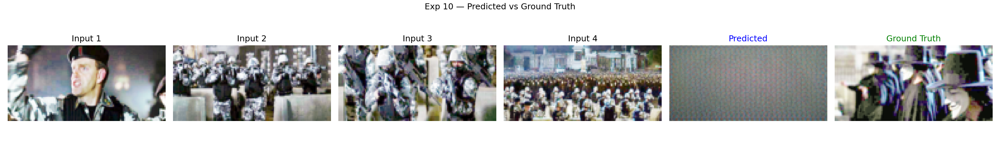
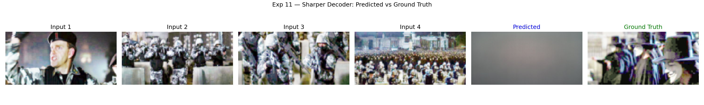
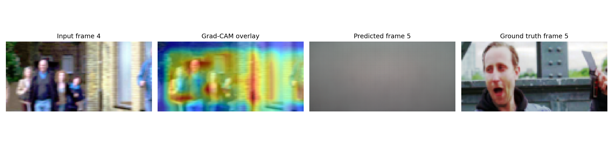
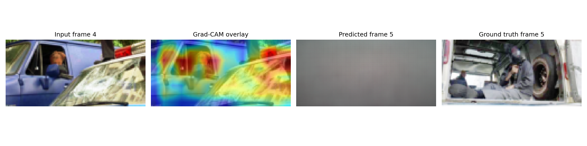

# dnnls_final_project_2

This is my DNNL project. The task is: given 4 frames of a comic-style story (each with an image and
a text description), predict what the 5th frame looks like, both the image and the text. Module is
Deep Neural Networks and Learning Systems (55-710365), Sheffield Hallam.

## What the model actually is

A visual encoder (either a small CNN I built or a frozen pretrained ResNet-18, depending on the
experiment) turns each frame into a vector. A text encoder (pretrained LSTM autoencoder, kept frozen
in most experiments) does the same for the description. These get fused - either just concatenated
together, or run through a cross-modal attention block I wrote so the image and text vectors can
attend to each other before fusing. The fused sequence goes through a GRU to get one vector
representing "what should come next", which then gets decoded back into an image and some text.

Dataset is [daniel3303/StoryReasoning](https://huggingface.co/datasets/daniel3303/StoryReasoning) on
HuggingFace. Trained everything in Colab since I don't have a GPU locally.

## Results

Honestly the loss numbers across most experiments are annoyingly close together, which made it hard
to tell what was actually helping. Here's what I got:

| # | What changed | Epochs | Final loss |
|---|---|---|---|
| 0 | Baseline (CNN + concat + GRU) | 25 | 4.361 |
| 1 | Cross-modal attention instead of concat | 25 | 4.360 |
| 2 | Swapped in frozen ResNet-18 | 35 | 4.406 |
| 3 | ResNet-18 + cross-modal attention together | 25 | 4.371 |
| 4 | Bigger latent dim (64 instead of 16) | 25 | 4.361 |
| 5 | Unfroze the text decoder + wider GRU (64) | 60 | **3.61** |
| 6 | Bidirectional GRU | 25 | 4.362 |
| 7 | 2-layer GRU | 25 | 4.352 |
| 8 | Added VGG perceptual loss | 25 | 4.31 |
| 9 | latent64 + perceptual loss + unfrozen decoder combined | 30 | 4.31 |
| 10 | Sharper decoder (pixel shuffle instead of transposed conv) | 60 | 3.61 |

Exp 5 is clearly the best number, but I should be upfront that it also just got way more epochs (60
vs 25-35 for everything else), so it's not really a fair one-variable-at-a-time comparison, more like
"the thing I happened to let train the longest also unfroze more of the model." Worth saying that
plainly rather than pretending it's a clean result.

Also, exp 8 and 9's numbers aren't really comparable to the others since they have an extra VGG
perceptual loss term added on top of the normal loss, so the number itself is measuring something
slightly different.

Loss curve for exp 5, the best run:

_loss.png)

## What the predictions actually look like

The loss table above hides something the numbers alone don't show: the predicted images across
every single experiment come out as a flat gray/beige blob, no visible structure. Here's exp 9 and
exp 10, predicted frame next to ground truth:

Text prediction and the loss curve going down were both real, so the model wasn't doing nothing -
it's specifically the image branch that collapsed. See the bug writeup below for why.

## Explainability (Grad-CAM)

Since this is a generation task rather than classification, there's no class score to backprop
from for Grad-CAM in the usual sense. Instead `src/gradcam.py` backprops from the image
reconstruction loss (L1 between predicted and target frame) on the last conv layer of the visual
encoder, using the exp 5 checkpoint (best loss, no retraining needed for this). The heatmap shows
which regions of an input frame the gradient says matter most for that loss.

Across the examples I ran, the heatmap consistently lights up on people/faces in the frame rather
than background, which is a sane thing for the model to be attending to even though the actual
predicted image it produces is the gray blob described above. More examples are in
`results/exp5/gradcam_examples/`.

## A bug I found (and only half-fixed)

At some point I actually looked at what the predicted images looked like instead of just trusting the
loss number, and they were basically a flat gray blob - no visible structure at all, even after the
full 60 epochs. Turned out the
decoder's forward() function was calling the same internal function twice and returning it as both
"content" and "context" - so it was literally the same tensor being pushed toward two different
targets at once (the real frame, and the average of the input frames) by two different loss terms.
That's almost certainly why the images across every experiment came out blurry - not just exp 10.

I fixed it by giving the decoder two separate output heads instead of one shared one. I didn't touch
the original decoder classes though, since experiments 0-10 above were already trained with the buggy
version and I didn't want to make that code silently not match what actually produced those results
anymore - the fix lives in a new class instead. Then I found a second problem on top: the text loss
number is just naturally way bigger than the image loss number (cross-entropy over a huge vocab vs.
L1 pixel loss), so even with two separate heads, the combined loss was still mostly "about text",
starving the image branch. Added a weight to fix that too.

Ran out of time to actually confirm this two-part fix works before the deadline. So this needs to be
said honestly in the presentation: found a real bug, understood why it was happening, fixed the code,
but couldn't finish verifying it before submission.

## Repo layout
- `src/model.py` - every architecture variant, roughly one comment block per experiment
- `src/train.py` - the training loop
- `src/utils.py` - dataset loading, CoT grounding stuff, the validation/plotting function
- `experiments.ipynb` - one section per experiment, meant to be run in Colab top to bottom
- `results/expN/` - trained weights + loss curve (and a prediction image, for some) per experiment
- `Baseline.ipynb` - the module's starter notebook, untouched
